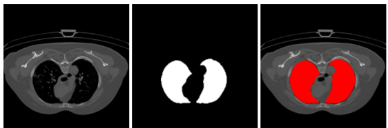
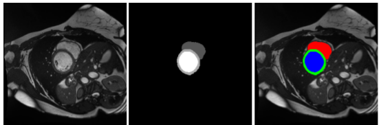

># U-Net的Pytorch实现


论文地址：https://arxiv.org/abs/1505.04597


>## 项目描述

U-Net 是一种用于图像分割的深度学习模型，它通过将输入图像与自身的上采样和下采样操作相结合，实现对图像中物体的准确分割。U-Net 模型的核心思想是通过在网络的不同层级上进行特征提取和信息传递，从而实现对图像中不同区域的准确分割。

本项目实现了 U-Net 模型的 PyTorch 版本，并提供了完整的代码实现。

>## 数据集

本项目使用的数据集为 [COVID19数据集](https://pan.baidu.com/s/15qnYoC7rMhXOcT0SYk4F3A?pwd=3ri7) 和[ACDC数据集](https://pan.baidu.com/s/12959GGUfoMJGrBr6SMySbA?pwd=hrmn)。

COVID19数据集示例：



下载链接： https://pan.baidu.com/s/15qnYoC7rMhXOcT0SYk4F3A?pwd=3ri7 提取码: 3ri7

ACDC数据集示例：



下载链接： https://pan.baidu.com/s/12959GGUfoMJGrBr6SMySbA?pwd=hrmn 提取码: hrmn

>## 实验结果
本项目对比的两种不同的损失函数对预测结果的影响，如下：

其中，CE表示交叉熵损失函数，CE+DL表示结合了交叉熵损失和Dice损失的联合损失函数。结果表明二者结合兼顾Dice的轮廓信息和Cross Entropy的像素级准确率，提高了模型的分割精度。


>## 使用方法

1. 克隆本项目到本地。
```bash
git clone git@github.com:pengyouwei/UNet-PyTorch.git
```
2. 安装所需的依赖库。
```bash
pip install -r requirements.txt
```
3. 下载数据集并将其放置在 `data` 文件夹下。

4. 修改 `config.py` 文件中的参数，例如数据集路径、模型保存路径、分割类别数量（COVID19数据集为2，ACDC数据集为4）等。

5. 运行 `train.py` 脚本开始训练模型。
```bash
python train.py
```
6. 运行 `predict.py` 脚本对测试集进行预测。
```bash
python predict.py --image_dir path/to/test/images_dir -w path/to/weights.pth
```
